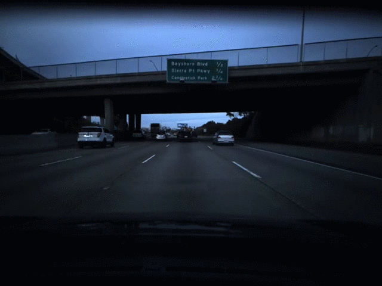

# RAFT

Cool way to calculate optical flow for two images very easily.

Seems to be very good: [Optical Flow Estimation Benchmark](https://paperswithcode.com/sota/optical-flow-estimation-on-sintel-clean)




**Paper:** [RAFT: Recurrent All Pairs Field Transforms for Optical Flow](https://arxiv.org/pdf/2003.12039)

**OG Repo:** [princeton-vl/RAFT](https://github.com/princeton-vl/RAFT)

## Requirements
```Shell
pip3 install -r requirements.txt
```

## How to use

We will use RAFT to create optical flow numpy arrays from two images and save them in a directory. First you will need to download the models. Just run:

```Shell
sh download_models.sh
```

After the download you can run the model on your images like this:

```Shell
run.py --images_dir=<YOUR DIRECTORY> --output_dir=<OUTPUT DIRECTORY>
```

## Visualize

You can visualize the .npy optical flow files with `vis.py`:

```Shell
vis.py ---npy_dir==<YOUR DIRECTORY> --output_dir=<OUTPUT DIRECTORY>
```
